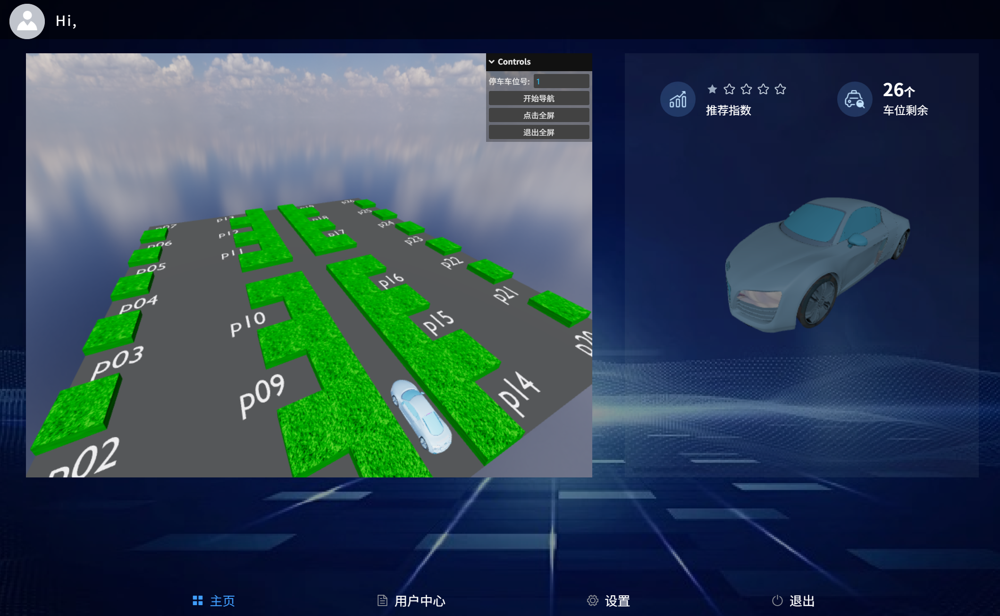

# 智能停车场引导系统

## 项目介绍

本项目使用Vue2框架结合Three.js实现了停车场的3D可视化系统。用户可以在3D场景中查看停车场布局，并通过输入车位号来获取最优停车路径的视觉引导。系统采用A*寻路算法计算最优行驶路线，提供直观的停车导航体验。

`注意`：该项目只发布了前端部分，后端服务未包含在此仓库中，因此目前仅仅提供根据项目停车场模型的导航展示。
本项目是我在学习Vue和Three.js过程中的实践成果，希望能对你有所帮助！


## 开始使用

**1. 环境要求**
- Node.js(版本14.x或以上)
- npm(版本6.x或以上)

**2. 安装**
```
npm install
```

**2. 启动项目**
```
npm run serve
```


## 使用说明

1. 在开启之后，直接右上的‘直接使用’（登录和注册不可用）
2. 项目会跳转到停车场页面，在停车车号位输入车位号，然后点击‘开始导航’即可看到导航路线


## 预览




## 注意事项

- 登录和注册不能使用
- 用户个人信息也不支持上传和查看
- 项目仅提供导航展示功能，不包含实际的停车和导航功能


## 致谢
感谢Three.js和Vue.js社区提供的优秀文档和示例代码。


